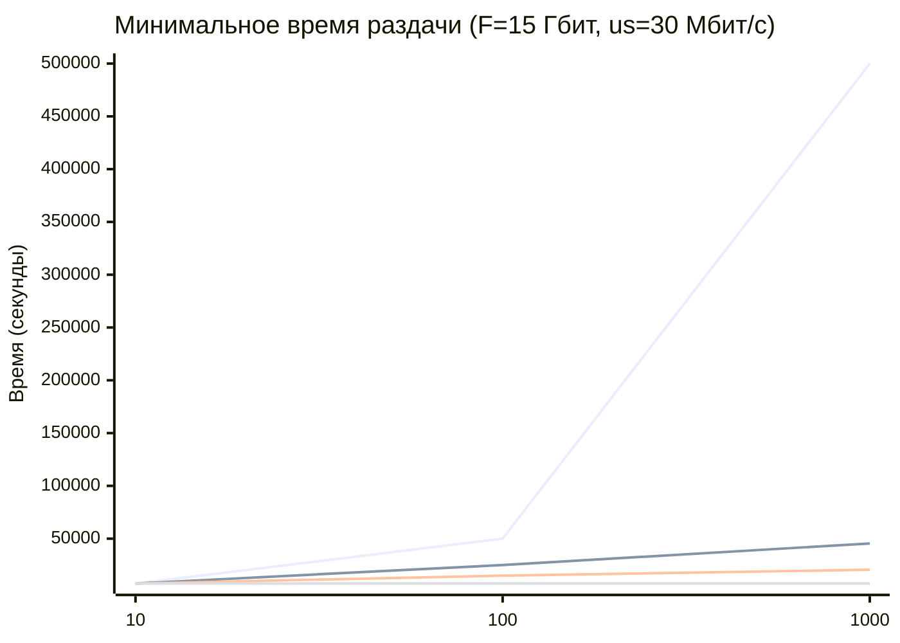

# Практика 5. Прикладной уровень

## Программирование сокетов.

### A. Почта и SMTP (7 баллов)

### 1. Почтовый клиент (2 балла)
Напишите программу для отправки электронной почты получателю, адрес
которого задается параметром. Адрес отправителя может быть постоянным. Программа
должна поддерживать два формата сообщений: **txt** и **html**. Используйте готовые
библиотеки для работы с почтой, т.е. в этом задании **не** предполагается общение с smtp
сервером через сокеты напрямую.

Приложите скриншоты полученных сообщений (для обоих форматов).

#### Демонстрация работы
todo

### 2. SMTP-клиент (3 балла)
Разработайте простой почтовый клиент, который отправляет текстовые сообщения
электронной почты произвольному получателю. Программа должна соединиться с
почтовым сервером, используя протокол SMTP, и передать ему сообщение.
Не используйте встроенные методы для отправки почты, которые есть в большинстве
современных платформ. Вместо этого реализуйте свое решение на сокетах с передачей
сообщений почтовому серверу.

Сделайте скриншоты полученных сообщений.

#### Демонстрация работы
todo

### 3. SMTP-клиент: бинарные данные (2 балла)
Модифицируйте ваш SMTP-клиент из предыдущего задания так, чтобы теперь он мог
отправлять письма с изображениями (бинарными данными).

Сделайте скриншот, подтверждающий получение почтового сообщения с картинкой.

#### Демонстрация работы
todo

---

_Многие почтовые серверы используют ssl, что может вызвать трудности при работе с ними из
ваших приложений. Можете использовать для тестов smtp сервер СПбГУ: mail.spbu.ru, 25_

### Б. Удаленный запуск команд (3 балла)
Напишите программу для запуска команд (или приложений) на удаленном хосте с помощью TCP сокетов.

Например, вы можете с клиента дать команду серверу запустить приложение Калькулятор или
Paint (на стороне сервера). Или запустить консольное приложение/утилиту с указанными
параметрами. Однако запущенное приложение **должно** выводить какую-либо информацию на
консоль или передавать свой статус после запуска, который должен быть отправлен обратно
клиенту. Продемонстрируйте работу вашей программы, приложив скриншот.

Например, удаленно запускается команда `ping yandex.ru`. Результат этой команды (запущенной на
сервере) отправляется обратно клиенту.

#### Демонстрация работы
todo

### В. Широковещательная рассылка через UDP (2 балла)
Реализуйте сервер (веб-службу) и клиента с использованием интерфейса Socket API, которая:
- работает по протоколу UDP
- каждую секунду рассылает широковещательно всем клиентам свое текущее время
- клиент службы выводит на консоль сообщаемое ему время

#### Демонстрация работы
todo

## Задачи

### Задача 1 (2 балла)
Рассмотрим короткую, $10$-метровую линию связи, по которой отправитель может передавать
данные со скоростью $150$ бит/с в обоих направлениях. Предположим, что пакеты, содержащие
данные, имеют размер $100000$ бит, а пакеты, содержащие только управляющую информацию
(например, флаг подтверждения или информацию рукопожатия) – $200$ бит. Предположим, что у
нас $10$ параллельных соединений, и каждому предоставлено $1/10$ полосы пропускания канала
связи. Также допустим, что используется протокол HTTP, и предположим, что каждый
загруженный объект имеет размер $100$ Кбит, и что исходный объект содержит $10$ ссылок на другие
объекты того же отправителя. Будем считать, что скорость распространения сигнала равна
скорости света ($300 \cdot 10^6$ м/с).
1. Вычислите общее время, необходимое для получения всех объектов при параллельных
непостоянных HTTP-соединениях
2. Вычислите общее время для постоянных HTTP-соединений. Ожидается ли существенное
преимущество по сравнению со случаем непостоянного соединения?

#### Решение
* Задержка распространения сигнала: $d_{распр} = \frac{10 \text{ м}}{3 \cdot 10^8 \text{ м/с}} \approx 3.33 \cdot 10^{-8} \text{ с}$. Задержка на порядки меньше секунд, можем игнорировать.
* Время передачи управляющего пакета (SYN, ACK, GET): $t_{упр} = \frac{200 \text{ бит}}{150 \text{ бит/с}} \approx 1.333 \text{ с}$
* Время передачи пакета данных (одного объекта): $t_{данные} = \frac{100 000 \text{ бит}}{150 \text{ бит/с}} \approx 666.667 \text{ с}$
* **1. Параллельные соединения:**
   * Время загрузки базового объекта (используется 1 соединение, доступна вся полоса $R$): $t_{базовый} = 3 \cdot t_{упр} + t_{данные} = 3 \cdot 1.333 \text{ с} + 666.667 \text{ с} = 670.67 \text{ с}$
   * Время загрузки 10 ссылок (10 параллельных соединений, каждому доступна полоса $R/10 = 15 \text{ бит/с}$): $t_{ссылки} = 3 \cdot \frac{200 \text{ бит}}{15 \text{ бит/с}} + \frac{100 000 \text{ бит}}{15 \text{ бит/с}} = 40 \text{ с} + 6666.667 \text{ с} = 6706.667 \text{ с}$
   * Общее время (непостоянное): $T_{непост} = t_{базовый} + t_{ссылки} = 670.667 \text{ с} + 6706.667 \text{ с} = 7377.334 \text{ с}$
* **2. Постоянное соединение:**
   * При постоянном соединении TCP-рукопожатие происходит лишь раз. Для всех объектов доступна полная скорость.
   * Время загрузки базового объекта не меняется: $t_{базовый} = 670.667 \text{ с}$
   * Загрузка остальных 10 объектов по уже открытому соединению (без использования конвейеризации, то есть GET-запрос и ответ на каждый объект): $t_{ссылки\_пост} = 10 \cdot (t_{упр} + t_{данные}) = 10 \cdot (1.333 \text{ с} + 666.667 \text{ с}) = 6680 \text{ с}$
   * Общее время (постоянное): $T_{пост} = 670.667 \text{ с} + 6680 \text{ с} = 7350.667 \text{ с}$

**Ответ:** 1) $7377.334 \text{ с}$; 2) $7350.667 \text{ с}$. Мы выиграли гдето 27с, что меньше процента, прикол в том, накладные расходы в порядки раз меньше полезной нагрузки, поэтому выйгрыш несущественен.

### Задача 2 (3 балла)
Рассмотрим раздачу файла размером $F = 15$ Гбит $N$ пирам. Сервер имеет скорость отдачи $u_s = 30$
Мбит/с, а каждый узел имеет скорость загрузки $d_i = 2$ Мбит/с и скорость отдачи $u$. Для $N = 10$, $100$
и $1000$ и для $u = 300$ Кбит/с, $700$ Кбит/с и $2$ Мбит/с подготовьте график минимального времени
раздачи для всех сочетаний $N$ и $u$ для вариантов клиент-серверной и одноранговой раздачи.

#### Решение
* Параметры системы: $F = 15 \text{ Гбит} = 15000 \text{ Мбит}$, $u_s = 30 \text{ Мбит/с}$, $d_{\min} = 2 \text{ Мбит/с}$. Скорость загрузки для всех пиров по условию одинаковая ($d_i = d_{\min}$).
* Формула минимального времени для клиент-серверной архитектуры: $D_{CS} = \max \left\{ \frac{N \cdot F}{u_s}, \frac{F}{d_{\min}} \right\}$
* Формула минимального времени для P2P архитектуры: $D_{P2P} = \max \left\{ \frac{F}{u_s}, \frac{F}{d_{\min}}, \frac{N \cdot F}{u_s + N \cdot u_i} \right\}$
* Подсчитаем базовые компоненты формул:
   * Отдача сервером одного файла: $\frac{F}{u_s} = \frac{15000}{30} = 500 \text{ с}$
   * Загрузка файла самым медленным пиром: $\frac{F}{d_{\min}} = \frac{15000}{2} = 7500 \text{ с}$
* Упрощенная формула для $D_{CS}$: $D_{CS} = \max \{ 500 \cdot N,\; 7500 \}$
* Упрощенная формула для $D_{P2P}$: $D_{P2P} = \max \left\{ 7500,\; \frac{15000 \cdot N}{30 + N \cdot u_i} \right\}$
* **График:**

- (синяя) Линия 1: Клиент-сервер ($D_{CS}$)
- (зелёная) Линия 2: P2P ($u = 300$ Кбит/с)
- (красная) Линия 3: P2P ($u = 700$ Кбит/с)
- (жёлтая) Линия 4: P2P ($u = 2$ Мбит/с)

* *Пример вычисления для $N=1000$ (P2P, $u_i=0.3$):* $D_{P2P} = \max \left\{ 7500,\; \frac{15000 \cdot 1000}{30 + 1000 \cdot 0.3} \right\} = \max \left\{ 7500,\; \frac{15000000}{330} \right\} \approx 45455 \text{ с}$.

**Ответ:** P2P как видно в разы лучше клиент-сервера, он лучше масштабируется, при тысяче разница больше порядка.

### Задача 3 (3 балла)
Рассмотрим клиент-серверную раздачу файла размером $F$ бит $N$ пирам, при которой сервер
способен отдавать одновременно данные множеству пиров – каждому с различной скоростью,
но общая скорость отдачи при этом не превышает значения $u_s$. Схема раздачи непрерывная.
1. Предположим, что $\dfrac{u_s}{N} \le d_{min}$.
   При какой схеме общее время раздачи будет составлять $\dfrac{N F}{u_s}$?
2. Предположим, что $\dfrac{u_s}{N} \ge d_{min}$. 
   При какой схеме общее время раздачи будет составлять  $\dfrac{F}{d_{min}}$?
3. Докажите, что минимальное время раздачи описывается формулой $\max\left(\dfrac{N F}{u_s}, \dfrac{F}{d_{min}}\right)$?

#### Решение
* **1. Случай $\frac{u_s}{N} \le d_{\min}$:**
   * В данном случае, если разделить пропускную способность сервера на всех поровну, она окажется меньше минимальной скорости скачивания любого из пиров. Значит, «узким местом» системы является исключительно канал сервера.
   * Схема: сервер делит свою общую скорость отдачи $u_s$ поровну между всеми $N$ пирами. Каждый пир получает данные со скоростью $\frac{u_s}{N}$.
   * Время загрузки для каждого пира составит $T = \frac{F}{u_s/N} = \frac{N \cdot F}{u_s}$. Поскольку сервер передает данные всем пирам одновременно, значит общее время равно $\dfrac{N F}{u_s}$.
* **2. Случай $\frac{u_s}{N} \ge d_{\min}$:**
   * Это означает, что $u_s \ge N \cdot d_{min}$. То есть общей скорости сервера хватит, чтобы отдавать данные **каждому** из $N$ пиров со скоростью $d_{min}$. 
   * Схема раздачи: сервер выделяет каждому клиенту полосу ровно в $d_{min}$. Общая используемая скорость сервера будет $N \cdot d_{min}$, что не превышает его лимит $u_s$.
   * При такой схеме каждый пир скачивает файл со скоростью $d_{min}$, следовательно, время загрузки для всех составит ровно $\dfrac{F}{d_{min}}$.
* **3. Доказательство:**
   * Пусть $D_{CS}$ — общее время раздачи.
   * Канал сервера: надо передать $N$ файлов размером $F$. Максимальная скорость сервера $u_s$. Значит, быстрее чем за $\frac{N \cdot F}{u_s}$ раздать физически не выйдет.
   * Канал самого медленного клиента: он качает файл $F$ со скоростью $d_{min}$. Он не скачает его быстрее, чем за $\frac{F}{d_{min}}$.
   * Так как оба ограничения работают одновременно, минимальное время раздачи не может быть меньше их максимума - $\max\left(\dfrac{N F}{u_s}, \dfrac{F}{d_{min}}\right)$
